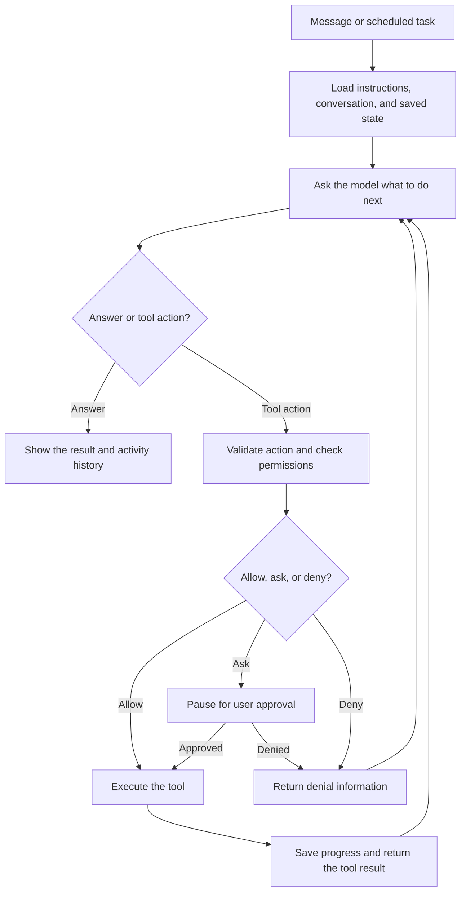

# Personal Open Dot

A personal agent I'm building in public with Python and LangGraph, inspired by three open-source takes on Dots.

**Status: planning and architecture.** This repository starts with the design and build plan. There is no runnable agent yet. I'll share working code and progress as the implementation takes shape.

Follow the build on X: **[@kaushik_holla](https://x.com/kaushik_holla)**.

## What I'm building

I want an agent that can take on a small, ongoing responsibility, remember the relevant context, use a limited set of tools, and ask me before making consequential changes.

The first use case is a GitHub repository assistant: check issues, identify what deserves attention, and prepare a daily summary. I'll start with read-only access before adding actions that change external systems.

The goal is to make the agent's behavior understandable: what it read, what it decided, which tools it used, and when it needs my input.

## Planned architecture

The main workflow will be:

1. Receive a message or scheduled task.
2. Load the task's instructions, conversation, and saved state.
3. Ask the model for an answer or a proposed tool action.
4. Validate the action and check permissions.
5. Pause for approval when required, or reject the action if it is disallowed.
6. Execute allowed actions and save progress.
7. Return tool results or denial information to the model and continue within a bounded run.
8. Show the final output and an activity history.

### Responsibilities of each component

| Component | Planned responsibility |
| --- | --- |
| Personal interface | Submit tasks, inspect summaries, review actions, and see progress. |
| Python API | Handle authenticated requests and connect the interface to the workflow. |
| LangGraph workflow | Coordinate model decisions, tool calls, checkpoints, and approval pauses. |
| Local state store | Persist conversations, task history, and workflow checkpoints. SQLite is the initial choice. |
| Action gateway | Validate tool names and inputs, enforce permissions, and record execution outcomes. |
| GitHub integration | Call GitHub's API directly using credentials scoped to the required repositories and operations. |
| Background worker | Start scheduled jobs and resume pending work while the service is running. |
| Model provider | Generate decisions and summaries. The first provider is still to be selected. |

Computer control and shell execution are outside the first milestone. I'll evaluate them later if a real use case needs them.

## What I'm drawing inspiration from

- **[Composio-community's Open Dot](https://github.com/composio-community/open-dot):** the repeated loop where the model chooses an action, receives its result, and decides what comes next.
- **[CopilotKit's OpenDots](https://github.com/CopilotKit/OpenDots):** a workspace where proposed work is visible and reviewable, rather than disappearing into a chat history.
- **[Anil Matcha's Open-Dots](https://github.com/Anil-matcha/open-dots):** an explicit action gateway that centralizes permission checks and tool execution.

These are architectural inspirations. This project is an independent implementation; it is not affiliated with OpenAI or the projects above.

## What I'm working on this weekend

My target is one small end-to-end workflow, rather than every capability of a general personal assistant:

- [ ] Set up the Python application and LangGraph workflow.
- [ ] Connect to one selected GitHub repository with read-only permissions.
- [ ] Retrieve issues and produce a useful summary.
- [ ] Persist task progress and results locally.
- [ ] Show the inputs, tool activity, and final output.
- [ ] Exercise the permission and approval boundary before introducing external writes.

Scheduled runs, recovery after interruption, a richer interface, and additional integrations will follow once the first workflow works reliably.

## Data and permissions

The design aims to keep conversation state and checkpoints local and use direct app APIs where practical. That reduces the number of intermediary services handling task data.

**Local storage does not mean local-only processing.** If I use a hosted model, the selected instructions, conversation context, and tool results sent to that model will leave the machine. Using a local model would change that data path.

The first integration will retrieve only the GitHub data needed for the task. I'll keep credentials out of prompts and logs, use narrow permissions, and require explicit approval for consequential external changes. These are implementation goals, not completed security guarantees.

## Follow the build

Star this repository to bookmark the project. Use GitHub's **Watch** settings if you want repository notifications, or follow **[@kaushik_holla on X](https://x.com/kaushik_holla)** for progress updates, architecture decisions, and lessons from the build.

I'll share what works, what changes, and what needs another pass.
